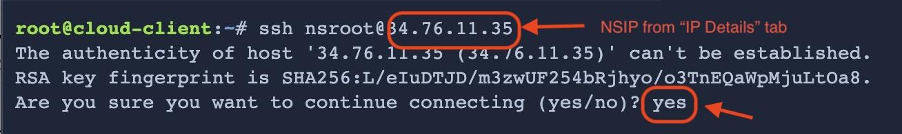

# Configure Citrix ADC with Ansible

## Reset password

First, let us set the new password to the Citrix ADC VPX deployed by running the playbook as follows.

Go to `Terminal` tab.

If not already done, please change your directory to the lab directory

```
cd /root/citrixadc-ansible-track/
```

Run the playbook
```
ansible-playbook -i inventory.txt citrixadc-first-time-password-reset.yaml
```


## Configure load balancer and services

```
ansible-playbook -i inventory.txt citrixadc-setuplb.yaml
```

> Upon successful run, you will get `ok=4  changed=4` in the terminal. This shows 4 resources/entities were created successfully by Ansible on your Citrix ADC.

Validate the configuration and the user traffic
==================================================

Now we have configured a load balancer which serves traffic to two backend servers.
We can check the status of the load balancer by going to `IP Details` tab

1. Go to `IP Details` tab
2. Open a new tab with the `VIP IP`.
3. You will see the load balancer is serving traffic to one of the backend servers.
4. Since the load balancer is configured to serve traffic in `ROUNDROBIN` mode, when you refresh the browser page, the load balancer will serve traffic to the next backend server.

Validate the configuration via Citrix ADC CLI
==========================================

Now, let us login to Citrix ADC via SSH and validate the configuration provisioned by Ansible.

1. Go to `Citrix ADC CLI Console` tab
2. Login via SSH to the Citrix ADC by running the below command. Replace `<NSIP>` with the NSIP of your Citrix ADC. You can get the NSIP from the `IP Details` tab.

   ```
   ssh nsroot@<NSIP>
   ```

3. Accept the fingerprint prompt by typing `yes`
   
4. Enter the password. If you had not changed the password in the previous step, the default password is `verystrongpassword`

Now you are in the Citrix ADC CLI console.

To list/show the load balancer configuration, run the following command.
```
show lb vserver lb-vserver-1
```

You can see the following information about the load balancer.


You can also check the status of the backend servers by running the following commands.
```
show service service-http-1
```

```
show service service-http-2
```

You can exit the CLI by typing the below command.
```
exit
```

That's how simple it is to configure Citrix ADC with Ansible. For any new Citrix ADC configurations, define the ansible playbook with the target configs and execute playbooks as above.

Now let us destroy the load balancer.

Please proceed to next step.
