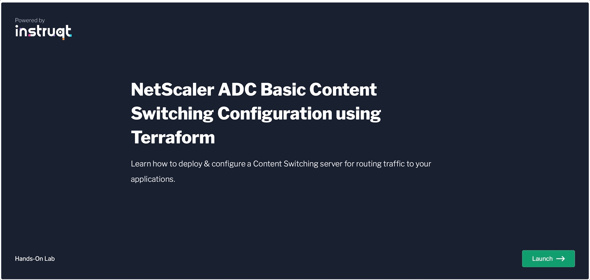

# NetScaler Automation Toolkit
NetScaler Automation Toolkit contains all the NetScaler tools to be used for making NetScaler part of DevOps and Automation pipelines.

The toolkit includes integrations with [CCA Tools](https://en.wikipedia.org/wiki/Continuous_configuration_automation), [APIs, SDKs](https://www.netscaler.com/platform/apis), native Public Cloud templates and more with a goal of supporting Day 0 - N operations using [Infrastructure-as-Code](https://www.netscaler.com/platform/infrastructure-as-code), scripting or coding.
NetScaler Automation is focusing on the practices of following the disciplines of Network Infrastructure and the disciplines of Programming. This repo has been created to serve as a one-stop shop for all information related to NetScaler Automation.

Below you will find more details on the topics of Infrastructure Provisioning, Configuration Managements, along with “how-to” guides, examples, labs, Golden templates and more.
In case you are looking for something that you can't find in the following links or you need further assistance please contact us on NetScaler-AutomationToolkit@cloud.com.
  

  

# Contents

- [NetScaler Automation Toolkit](#netscaler-automation-toolkit)
- [Contents](#contents)
- [Community](#community)
- [Events](#events)
- [Training Labs](#training-labs)
- [Technical Blogs](#technical-blogs)
- [Recorded Sessions](#recorded-sessions)
- [Partners](#partners)
- [Automation Toolkit Repositories](#automation-toolkit-repositories)
- [Examples Library](#examples-library)
- [Golden Templates](#golden-templates)

# Community
NetScaler Automation Toolkit consists of solutions that are open-sourced and we are trying to build a community for everyone that is intrested in using NetScaler with DevOps / Automation.
  Are you interested in engaging with us? Please be part of the NetScaler Community and check [NetScaler Automation](https://community.netscaler.com/s/topic/0TO8b000000QnUHGA0/automation?tabset-3320a=2).
  

# Events
Do you want to learn more about the work we are doing? What are the new Automation Toolkit updates? Or check a technical session? Join our upcoming webinars and live demo sessions or watch the recordings on demand.
|            Title            |            Details            |            Date            | Code |
|-----------------------------|-------------------------------|----------------------------| -- |
| [Security as Code (SaC) 101:  Configure NetScaler WAF using Ansible to protect your applications.](https://community.netscaler.com/s/webinar/a078b000016LKr6AAG/embrace-security-as-codesac-to-configure-netscaler-waf-to-protect-your-apps) | NetScaler Live Demo | Wednesday, Sep 20th, 2023  11:00 AM EDT   8:00 AM PST   5:00 PM CET | [Code](events/20230920/) |
| [Automating NetScaler Configurations with NetScaler Ansible Collection v.2.0](https://community.netscaler.com/s/webinar/a078b000010ripvAAA/automating-netscaler-configurations-with-ansible) | NetScaler Live Demo | Wednesday, Aug 16th, 2023  11:00 AM EDT   8:00 AM PST   5:00 PM CET | [Code](events/20230816/) |
| [NetScaler Automation Toolkit Updates +   NetScaler Ansible Collection v.2.0 Alpha](https://community.netscaler.com/s/webinar/a078b000010rf74AAA/netscaler-connect-webinar-27th-july) | NetScaler Connect Webinar   Europe & ASIA | Thursday, Jul 27th, 2023  10:30 AM CEST | |
| [NetScaler Automation Toolkit Updates +   NetScaler Ansible Collection v.2.0 Alpha](https://community.netscaler.com/s/webinar/a078b000010rf74AAA/netscaler-connect-webinar-27th-july) | NetScaler Connect Webinar   Americas | Thursday, Apr 27th, 2023  11:00 AM EDT   8:00 AM PST | |
| [Automating Gateway Configurations with Golden Terraform templates:  LDAP - RADIUS configuration.](https://community.netscaler.com/s/webinar/a078b000010v51jAAA/automating-gateway-configurations-with-golden-terraform-templates-ldap-radius) | NetScaler Live Demo | Wednesday, Jun 07th, 2023  11:00 AM EDT   8:00 AM PST   5:00 PM CET | [Code](golden_templates/netscaler_gateway/) |
| [NetScaler Automation Toolkit Updates +   Learning Material & Training Labs for Automation Toolkit](https://community.netscaler.com/s/webinar/a078b000010v2BQAAY/netscaler-connect-webinar-25th-may) | NetScaler Connect Webinar   Europe & ASIA | Thursday, May 25th, 2023  10:30 AM CEST | |
| [NetScaler Automation Toolkit Updates +   Learning Material & Training Labs for Automation Toolkit](https://community.netscaler.com/s/webinar/a078b000010v2BQAAY/netscaler-connect-webinar-25th-may) | NetScaler Connect Webinar   Americas | Thursday, May 25th, 2023  11:00 AM EDT   8:00 AM PST | |
| [NetScaler Automation Toolkit Updates](https://community.netscaler.com/s/webinar/a078b000010uzE3AAI/netscaler-connect-webinar-27th-april) | NetScaler Connect Webinar   Europe & ASIA | Thursday, Apr 27th, 2023  10:30 AM CEST | |
| [NetScaler Automation Toolkit Updates](https://community.netscaler.com/s/webinar/a078b000010uzE3AAI/netscaler-connect-webinar-27th-april) | NetScaler Connect Webinar   Americas | Thursday, Apr 27th, 2023  11:00 AM EDT   8:00 AM PST | |
| [Transforming a Linux Host into a NetScaler BLX with Terraform:  A Hands-On Demonstration.](https://community.netscaler.com/s/webinar/a078b000010uvztAAA/transforming-a-linux-host-into-a-netscaler-blx-with-terraform) | NetScaler Live Demo | Wednesday, Feb 22nd, 2023  11:00 AM EDT   8:00 AM PST   5:00 PM CET | |
| [Automating NetScaler Configurations Using Terraform:  A Hands-on Demonstration.](https://community.netscaler.com/s/webinar/a078b000010uwOMAAY/automating-netscaler-configurations-using-terraform-a-handson-demonstration) | NetScaler Live Demo | Monday, Feb 06th, 2023  11:00 AM EDT   8:00 AM PST   5:00 PM CET | [Code](events/20230206/) |
  

# Training Labs
Do you want to explore Automation Toolkit and you don't know where to start? We are providing hands-on training labs with zero cost.

Firt login to [NetScaler Community](https://community.netscaler.com/) using your social media account or create an account using your personal email and then.

Then access one of following labs to do some hands-on training using Terraform or Ansible with NetScaler.
  

|            Title            |            Solution            |            Video            |             Code            |
|-----------------------------|----------------------------|----------------------------|----------------------------|
| [Deliver Apps with NetScaler and Terraform:  Basic Load Balancing Configurations.](https://community.netscaler.com/s/netscaler-labs?labId=000001068) | Terraform | [YouTube](https://youtu.be/tl453GW_sxQ) | [Code](https://github.com/netscaler/automation-toolkit/tree/main/labs/deliver-apps-with-netscaler-adc-terraform-provider) |
| [Basic Content Switching Configuration using Terraform.](https://community.netscaler.com/s/netscaler-labs?labId=000001281) | Terraform | [YouTube](https://www.youtube.com/watch?v=LlGqbzyruUA&ab_channel=NetScaler) | [Code](https://github.com/netscaler/automation-toolkit/tree/main/labs/basic-content-switching-configuration-using-terraform) |
| [Basic Rewrite / Responder Policies Configuration using Terraform.](https://community.netscaler.com/s/netscaler-labs?labId=000001283) | Terraform | [YouTube](https://www.youtube.com/watch?v=cl3yHiwvNJY&list=PLq9Ti1Jr8MhGj3xSb4-LpD78hEiaGw5RT&index=4&ab_channel=NetScaler) | [Code](https://github.com/netscaler/automation-toolkit/tree/main/labs/netscaler-adc-basic-rewrite-responder-policies-configuration-using-terraform) |
| [Basic Application Protection Configuration (WAF) using Terraform.](https://community.netscaler.com/s/netscaler-labs?labId=000001284) | Terraform |  | [Code](https://github.com/netscaler/automation-toolkit/tree/main/labs/netscaler-adc-basic-application-protection-configuration-waf-using-terraform) |
| [Deliver Apps with NetScaler and Ansible.](https://community.netscaler.com/s/netscaler-labs?labId=000001069) | Ansible |  | [Code](https://github.com/netscaler/automation-toolkit/tree/main/labs/deliver-apps-with-citrix-adc-and-ansible) |
| [Basic Content Switching Configuration using Ansible.](https://community.netscaler.com/s/netscaler-labs?labId=000001392) | Ansible | | |
| [Basic Rewrite / Responder Policies Configuration using Ansible.](https://community.netscaler.com/s/netscaler-labs?labId=000001393) | Ansible | | |
| [Basic Application Protection Configuration (WAF) using Ansible.](https://community.netscaler.com/s/netscaler-labs?labId=000001394) | Ansible |  | |
  

  

# Technical Blogs
Do you want to read some cool articles around Automation?  
Please check the following links.

|            Category            |            Details            |
|-----------------------------|-------------------------------|
| [Terraform Blogs](https://community.netscaler.com/s/topic/0TO8b000000QnX5GAK/terraform?tabset-3320a=2) | Terraform Blogs |
| [Ansible Blogs](https://community.netscaler.com/s/topic/0TO8b000000QnX6GAK/ansible?tabset-3320a=2) | Ansible Blogs |
  

# Recorded Sessions
Do you want to read some cool articles around Automation?  
Please check the following links.

|            Category            |            Solution            |
|-----------------------------|-------------------------------|
| [Infrastructure as Code with Citrix ADC](https://www.youtube.com/watch?v=ZmJXtXmkCPE) | All solutions |
| [Dynamic Networking with Consul-Terraform-Sync for Terraform Enterprise and Citrix ADC](https://www.youtube.com/watch?v=OQzPBmZ7uZ8) | Terraform |
| [Automate your Citrix ADC deployments with Terraform](https://www.youtube.com/watch?v=IJIIWm5rzpQ&t=18s&ab_channel=Citrix) | Terraform |
| [Deploying and Configuring Citrix ADC BLX (Baremetal) with Terraform](https://www.youtube.com/watch?v=3hNWfRKidNI) | Terraform |
| [Quickly Provision and Configure Citrix ADC High Availability(HA) across Availability Zones in AWS](https://www.youtube.com/watch?v=LgGS0-Q5ODE) | Terraform |
| [Get Your Apps to Production Faster with an Infrastructure as Code Approach to ADC](https://www.youtube.com/watch?v=VIqmQ31of_0) | Terraform |
| [Citrix ADC HA pair deployment on AWS made effortless: using Cloud Formation Template](https://www.youtube.com/watch?v=H_Nv688Im2M&ab_channel=Citrix) | AWS CloudFormation Templates (CFT) Templates |
| [AWS QuickStart for Citrix ADC: Simple and Speedy deployment of Citrix ADC VPX for web applications](https://www.youtube.com/watch?v=1ht2q4Gwfmk&ab_channel=Citrix) | AWS CloudFormation Templates (CFT) Templates |
| [Deploy Citrix ADC High Availability Solution on GCP using Google Deployment Manager Templates](https://www.youtube.com/watch?v=KF5OKKrCJNU&ab_channel=Citrix) | Google Cloud Deployment Manager (GDM) templates |
  

# Partners
We have strong technical partnerships with both [HashiCorp](https://www.hashicorp.com/partners/tech/citrix#all) and [Red Hat](https://www.ansible.com/integrations/networks/citrixadc).
Both our Terraform providers and our Ansible modules have been certified from our partners. Please check under [Automation Toolkit Repositories](#automation-toolkit-repositories) to find more details for each one of our integrations.
  

# Automation Toolkit Repositories
Our Automation Toolkit is fully open-sourced. Using the following links you can navigate to the relevant repositories where we maintain the implementation for each one of our solutions.
|            Title            |            Details            |
|-----------------------------|-------------------------------|
| [Terraform Provider for NetScaler ADC](https://github.com/citrix/terraform-provider-citrixadc) | NetScaler has developed a Terraform provider for automating NetScaler ADC deployments and configurations. Using Terraform, you can configure your ADCs for different use-cases such as Load Balancing, SSL, Content Switching, GSLB, WAF etc. |
| [Terraform Provider for NetScaler SDX](https://github.com/citrix/terraform-provider-citrixsdx) | Terraform provider for NetScaler SDX provides Infrastructure as Code (IaC) to manage your ADCs via SDX. Using the terraform provider you can provision VPXs on SDX, start, stop, reboot the VPXs on SDX. |
| [Terraform Provider for NetScaler BLX](https://github.com/citrix/terraform-provider-citrixblx) | NetScaler has developed a Terraform provider for automating Citrix BLX deployments and configurations. Using Terraform, you can deploying and configure a NetScaler ADC BLX. |
| [Terraform Provider for NetScaler ADM](https://github.com/citrix/terraform-provider-citrixadm) | Terraform provider for NetScaler ADM Service provides Infrastructure as Code (IaC) to manage your ADCs via ADM. Using the terraform provider you can onboard ADCs in ADM, assign licenses, create and trigger stylebooks, run configpacks etc. |
| [Ansible Modules for NetScaler ADC](https://github.com/citrix/citrix-adc-ansible-modules) | This repository contains the NetScaler ADC Ansible modules. |
| [Ansible Modules for NetScaler ADM](https://github.com/netscaler/ansible-collection-netscaleradc/tree/citrix.adc) | This repository contains two collections: One for the ADM Ansible modules and one for the old NetSclaer ADC Ansible modules. |
| [NetScaler AWS CloudFormation Templates](https://github.com/citrix/citrix-adc-aws-cloudformation) | This is a repository for NetScaler ADC's CloudFormation templates for deploying NetScaler ADC in AWS (Amazon Web Services). |
| [NetScaler Azure ARM Templates](https://github.com/citrix/citrix-adc-azure-templates) | This repository hosts NetScaler ADC ARM (Azure Resource Manager) templates for deploying Citrix ADC in Microsoft Azure Cloud Services. |
| [NetScaler GCP GDM Templates](https://github.com/citrix/citrix-adc-gdm-templates) | This repository hosts NetScaler ADC GDM templates for deploying a NetScaler ADC VPX instance on the Google Cloud Platform. |
| [Terraform Cloud Scripts](https://github.com/citrix/terraform-cloud-scripts) | This repository contains terraform scripts for automating NetScaler ADC deployment on AWS, Azure, GCP and ESX. |
  

# Examples Library
We have created many examples of how to use our toolkit. These examples cover different use case. Please use the following links to navigate to the examples for the solution that you are interested. If you can't find something you are looking for send us an email at NetScaler-AutomationToolkit@cloud.com and we'll be happy to help you.

|            Title            |            Details            |
|-----------------------------|-------------------------------|
| [Azure Deployment Scripts](https://github.com/citrix/terraform-cloud-scripts/tree/master/azure#azure-automation-scripts) | Terraform configuration scripts to deploy NetScaler ADC on Microsoft Azure. |
| [AWS Deployment Scripts](https://github.com/citrix/terraform-cloud-scripts/tree/master/aws) | Terraform configuration scripts to deploy NetScaler ADC on AWS. |
| [GCP Deployment Scripts](https://github.com/citrix/terraform-cloud-scripts/tree/master/gcp) | Terraform configuration scripts to deploy NetScaler ADC on Google Cloud Platform (GCP). |
| [ESXi Deployment Scripts](https://github.com/citrix/terraform-cloud-scripts/tree/master/esxi) | Terraform configuration scripts to deploy NetScaler ADC on ESXi hosts using the vsphere terraform provider. |
| [NetScaler ADC Configuration Scripts ](https://github.com/citrix/terraform-provider-citrixadc/tree/master/examples#citrix-adc-configuration-examples) | Terraform configuration scripts that cover different examples of how to use the NetScaler ADC Terraform provider. |
| [NetScaler SDX Automation Scripts](https://github.com/citrix/terraform-provider-citrixsdx/tree/master/examples) | Terraform configuration scripts that cover different examples of how to use the NetScaler SDX Terraform provider to manage your ADCs via SDX. Using this provider you can provision VPXs on SDX, start, stop, reboot the VPXs on SDX. |
| [NetScaler BLX Automation Scripts](https://github.com/citrix/terraform-provider-citrixblx/tree/master/examples) | Terraform configuration scripts that cover different examples of how to use the NetScaler BLX Terraform provider. |
| [NetScaler ADM Automation Scripts](https://github.com/citrix/terraform-provider-citrixadm/tree/master/examples) | Terraform configuration scripts that cover different examples of how to use the NetScaler ADM Terraform provider. |
| [Ansible Playbooks for ADC and ADM](https://github.com/citrix/citrix-adc-ansible-modules/tree/master#adc-modules) | Ansible Playbooks that cover different examples of how to use the NetScaler Ansible Modules to configure different features on ADC or ADM. |
  

# Golden Templates
Using a predefined Infrastructure-as-Code template allows administrators to deploy systems consistently with clear and known configuration that follows NetScaler best practices. Our engineering teams have created these templates for you that cover different use case. Please use the following links to navigate to the best practices that you are interested. If you can't find something you are looking for send us an email at NetScaler-AutomationToolkit@cloud.com and we'll be happy to help you.

|            Title            |            Tool            |           Details            |
|-----------------------------|-------------------------------|-------------------------------|
| [Configure a simplified gateway with LDAP and RADIUS authentication](https://github.com/netscaler/automation-toolkit/tree/main/golden_templates/netscaler_gateway/ldap_radius) | Terraform | Best practices to configure a simplified gateway with LDAP and RADIUS authentication using Terraform |
| [Configure a simplified gateway with SAML authentication](https://github.com/netscaler/automation-toolkit/tree/main/golden_templates/netscaler_gateway/saml) | Terraform | Best practices to configure a simplified gateway with SAML authentication using Terraform |
| [Configure a simplified gateway with OAuth authentication](https://github.com/netscaler/automation-toolkit/tree/main/golden_templates/netscaler_gateway/oauth) | Terraform | Best practices to configure a simplified gateway with OAuth authentication using Terraform |
| [Upgrade a NetScaler standalone appliance](https://github.com/netscaler/automation-toolkit/tree/main/golden_templates/upgrade-netscaler/standalone) | Ansible | Best practices to upgrade a NetScaler standalone appliance using Ansible |
| [Upgrade a NetScaler high availability pair](https://github.com/netscaler/automation-toolkit/tree/main/golden_templates/upgrade-netscaler/high-availability/normal-mode) | Ansible | Best practices to upgrade a NetScaler high availability pair using Ansible |
| [Upgrade a NetScaler high availability pair using In Service Software Upgrade (ISSU)](https://github.com/netscaler/automation-toolkit/tree/main/golden_templates/upgrade-netscaler/high-availability/issu-mode) | Ansible | Best practices to upgrade a NetScaler high availability using In Service Software Upgrade (ISSU) with Ansible |

  

